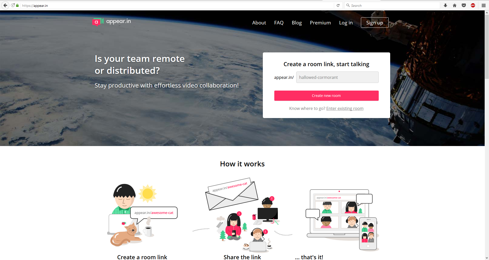
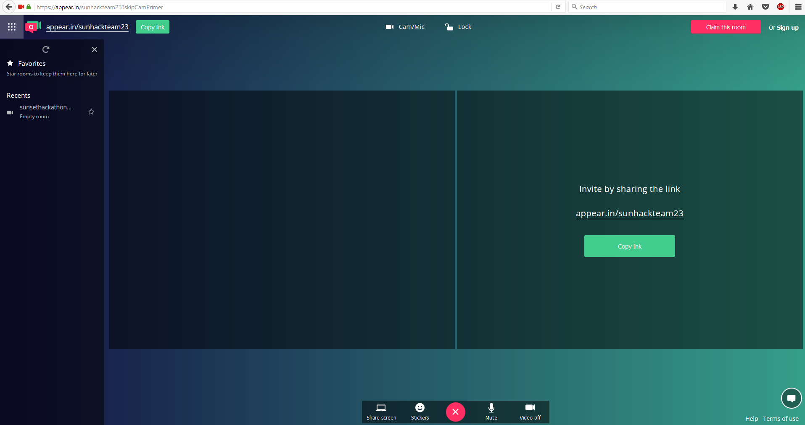

TO DO : Inserir as imagens

O Appear In  é uma ferramenta para chamadas e conferências online que permite a articulação de chamadas com várias pessoas com o mínimo de esforço, bastando apenas a configuração de um canal dando-lhe um nome e passar um link para os colegas.

# Notas:
* Alguns colegas reportaram algumas incompatibilidades
* Convém testar previamente porque sendo a partir do browser, eventualmente tem que dar algumas permissões
* Devem testar a vossa ligação à net
* Devem usar um microfone e testá-lo
* Devem colocar em mute quando não estão a falar para que a conversa seja fluída e sem ruído de fundo.
* Podem usar a app para mobile

# Links
https://appear.in/

# Tutorial

Entrar no site e o membro da equipa cria um canal como na imagem em baixo. Sugerimos a inclusão da equipa no canal para facilitar a comunicação. 

Algo do género: “sunhackteamXX”

b) Validar caso seja necessário:

c) Utilizar:

Simples.
