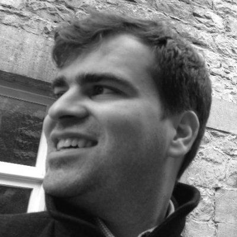

# O que é o Sunset Hackathon?

O Sunset Hackathon é uma maratona tecnológica para 50 pessoas que pretende reunir os melhores 5% do talento nacional em Hardware, Software, 3D Printing e Produtização, criando pequenas equipas interessadas em desafios ambiciosos. Esta maratona irá realizar-se nos dias 1, 2 e 3 de Setembro no Cais Criativo de Ílhavo, na praia da Costa Nova, um recinto único localizado junto à praia. 

Os objectivos do Sunset Hackathon passam por:
* Desenvolver novos Produtos  / novas ideias;
* Identificar talentos nacionais e empresas inovadoras;
* Crescer a comunidade de desenvolvimento de produtos de hardware;
* Criar um evento de renome mundial para as empresas de hardware.

O público alvo deste evento são todas as pessoas com perfil criativo e inovador, com espírito empreendedor. Em particular procuram-se pessoas com capacidades de desenvolvimento de produto / prototipagem, hardware e software developers, conhecedores de impressão 3D, designers e marketing.

# O que é o Hardware City?

É uma associação para a promoção do conhecimento de produtização que  tem como missão aproximar as startups de hardware da Indústria e dos Makers. Esta associação organiza sessões abertas sobre temáticas ligadas à Indústria 4.0 e ao desenvolvimento de produto, participa activamente nas várias comunidades de criadores, programadores e criativos que partilham os mesmos gostos pela tecnologia e por desafios nesta área.

# Quem são os nossos mentores?

## Hugo Plácido da Silva / Bitalino

Hugo acredita que é uma das poucas pessoas sortudas que pode dizer que trabalhou muitos poucos dias na sua vida… não por falta de emprego (felizmente), mas porque quando tu fazes coisas que amas, e estás apaixonado por quase todos os dias, não há limites entre o que é o trabalho e o que é pura diversão. 

Ele completou o seu doutoramento em engenharia electronica e computadores na universidade de Lisboa. Desde 2004, Hugo é um investigador no IT – Institudo de Telecomunicações. Hugo é também um dos co-fundadores da PLUX - Wireless Biosignals, criada em 2007 como uma empresa inovadora baseada em tecnologia que atua no campo de dispositivos médicos para cuidados de saúde e qualidade de vida, onde atualmente é Board Member e Innovation Advisor. 

Mais recentemente, ele tem vindo a trabalhar ativamente (ou seja, divertindo-se) para tornar o mundo um pouco mais fisiológico através do BITalino, um software de código aberto e um toolkit de hardware de baixo custo, que permite que qualquer pessoa, desde estudantes até criadores de aplicativos profissionais, criem projetos ‘cool’ e aplicações com sensores fisiológicos. 



Suas principais áreas de interesse incluem computação fisiológica (aka biosignals), engenharia de sistemas, processamento de sinal e reconhecimento de padrões.

**Links**
[Link 1](https://www.it.pt/Members/Index/1293) /
[Link2](https://www.linkedin.com/in/hugo-silva-0661763/)

## Michaël MEMETEAU / NESTO

Tudo começou com LEGO… Desde então, ficou com o bichinho de construir "coisas".
Depois de uma passagem na indústria automóvel tanto do lado dos construtores como dos fornecedores, ainda passou por consultores para depois criar com um amigo uma das primeiras plataformas online de gestão de frotas (a primeira implementação comercial de MongoDB em Portugal). Envergou outra vez para o lado do empreendedorismo com NESTO, uma plataforma IoT de gestão logística para botijas de gás baseada em balanças conectadas.
É também um entusiasta da impressão 3D (com vários criações em open-source como o [Saintflint](https://www.thingiverse.com/thing:979113), um extrusor de conceito revolucionário) e o animador da comunidade portuguesa de Onshape (uma aplicação online de CAD maker-friendly).
Também foi visto a emergir vivo no tanque de tubarões.

## Tiago Rebelo / CEiiA

Tiago Rebelo é licenciado em Engenharia Aeronáutica pela Universidade da Beira Interior, Mestre em Tecnologia Espacial (MSc with a Major in Space Technology) pela Luleå University of Technology na Suécia e Mestre em Astronáutica e Engenharia Espacial (MSc in Astronautics and Space Engineering) pela Universidade de Cranfield no Reino Unido, onde se graduou com distinção. Foi bolseiro do programa de formação internacional Erasmus Mundus – SpaceMaster e participante no programa Caltech Space Challenge. Recentemente concluiu com sucesso a parte curricular do programa de doutoramento do MIT Portugal - Engineering Design and Advanced Manufacturing.
No início da sua carreira Tiago foi investigador na área de AOCS/GNC & Flight Dynamics na Airbus Defence and Space, tendo colaborado também com a Universidade Técnica de Munique (TUM) e a Agência Espacial Europeia (ESA), onde foi bolseiro do Directorate of Human Spaceflight & Operations.
No CEiiA, o Tiago participou no seu passado na execução e gestão de vários projetos de I&D na área da Aeronáutica, sendo atualmente o Responsável Técnico da área de Engenharia Aeroespacial e dos Oceanos, tendo a seu cargo uma equipa multidisciplinar que procura fazer face aos complexos desafios associados ao desenvolvimento de produto para estas áreas.

## André João / CEiiA

André João é Licenciado em Engenharia Aeroespacial pelo Instituto Superior Técnico. Iniciou a sua carreira como Engenheiro de Projeto responsável por desenhar componentes aeronáuticos para o avião militar Embraer KC-390, sendo mais tarde líder de uma equipa de engenheiros responsável por libertar os desenhos técnicos de componentes para produção e por dar suporte ao cliente. De momento trabalha como Engenheiro de Desenvolvimento de Produto da área de Engenharia Aeroespacial e dos Oceanos, sendo responsável pelo projeto de componentes e elaboração dos desenhos técnicos relativos aos veículos e plataformas desenvolvidos na área.

## David Brandão / CEiiA

David Brandão é Mestre em Engenharia Aeroespacial pelo Instituto Superior Técnico e pelo Politecnico di Torino, tendo desenvolvido a Tese de Mestrado em aeroelasticidade na Universidade de Victoria, Canadá. Atualmente é Engenheiro de Mecânica de Fluídos Computacional na área de Engenharia Aeroespacial e dos Oceanos do CEiiA, sendo responsável pela análise hidrodinâmica, aerodinâmica e de estabilidade dos produtos desenvolvidos, atuando em vários projetos, desde o desenvolvimento de um Veículo Autónomo Subaquático para 3000 metros de profundidade, assim como de plataformas para monitorização da vida marinha.

## Pedro Patrício / Clube de Criativos

Estudou Design de comunicação e técnicas de impressão na Escola António Arroio. Em seguida passou pelo ISCTE onde passou 3 anos pelo curso de Sociologia. Em seguida, no INESC/FUNDETEC, estudou linguagens de programação e gestão de sistemas informáticos. Depois de ter passado por diversos empregos sem grande história mas sempre ligados à computação gráfica, ingressou no grupo PT. Em 1996, foi um dos fundadores do departamento de desenvolvimento WEB da Telepac (Grupo PT) enquanto, fora de horas, trabalha como Digital designer para diversas agências de comunicação e dá aulas de Design digital na ETIC. Em 1998, seguindo o seu sonho de abrir uma agência de comunicação Digital, funda - em conjunto com o seu cúmplice de sempre, Nuno Silva - a WIZ Interactive. Em 2000 faz o seu último trabalho de design e assume a gestão de projetos e clientes da WIZ Interactive. Trabalha Clientes como IKEA, AUDI, OPTIMUS, Unilever, Galp entre muitos outros que cruzaram a rota da agência. Em 18 anos, a Wiz Interactive ganhou 87 prémios e nomeações nacionais e internacionais. Foi membro de júris de diversos festivais de criatividade nacionais e Internacionais como o Clube de Criativos de Portugal, Criatividade Lusófona, Cannes Young Lions e EL OJO de Ibero America. Integra a direcção do Clube de Criativos de Portugal desde 2011. 

## André Leite Ferreira / Bosch

Em 2006, Andre graduou-se em Engenharia Informática pela Universidade do Minho iniciando trabalho nas áreas de desenvolvimento e garantia de qualidade em software. Em Desenvolveu um trabalho de doutoramento em colaboração com a indústria em metodologias para melhoria do processo de software. Em 2015 entrou na Bosch na área de desenvolvimento de novos produtos para o ramo automóvel. Atualmente é gestor técnico de linhas de inovação para a divisão de Car Multimedia em Braga. Andre é também professor convidado no Departamento de Informática na Universidade do Minho.

[Link](https://www.linkedin.com/in/alferreira/)

## Jochen Wingbermueh / Bosch

Apos a graduação em Engenharia eletrotécnica, com especialização em telecomunicações, Jochen iniciou funções na universidade de Hannover como investigador na área de analise e reconstrução 3D baseada em camaras. Em paralelo Jochen fundou uma start-up dedicada ao desenvolvimento de scanners 3D. Em 2005 entrou na Bosch na área de “corporate research” para desenvolver algoritmos de processamento de imagem e “machine learning” para várias aplicações de visão computacional. 5 Anos mais tarde tornou-se gestor responsável pelo grupo de sistemas de visão computacional. Actualmente é gestor de inovação da fabrica de “car multimédia” em Braga.

[Link](https://www.linkedin.com/in/jochen-wingberm%C3%BChle- 9136a2b0/)

## Ricardo Pereira / Consultor

Nascido em 1982 no Porto, Ricardo licenciou-se em Design Industrial na Faculdade Lusíada do Porto em 2007. No decurso da Licenciatura leccionou informática (Adobe Photoshop e Flash) numa escola professional e, após a sua conclusão, trabalhou como freelancer renderizando para o sector da Construção Civil e foi admitido no Instituto de Engenharia Mecânica INEGI, sendo responsável pela produção de moldes, protótipos rígidos e flexíveis. No decurso deste período de três anos desenvolveu técnicas de modelação 3D para próteses e instrumentos de âmbito médico, bem como o recurso à moldação por cera perdida na materialização de modelos de ligas de Titânio. Em 2011 foi co-fundador da Associação Problender – Associação Portuguesa de Blender, e em 2017 do Hardware City. Presentemente, trabalha em nome individual dando consultadoria na área do desenvolvimento de produto e prototipagem. 

## José Sousa / OLI

Terminado o Mestrado Integrado em Engenharia Mecânica na Universidade de Aveiro em 2013 com uma dissertação sobre materiais compósitos, faz investigação na Universidade de Aveiro, durante 2 anos, na área dos metais. Em 2015 ingressa na OLI – Sistemas  Sanitários S.A. para o Departamento de Design e Desenvolvimento, onde exerce funções de design de produto, projeto de componentes poliméricos e gestão de projeto, entre outras.

## Hugo Moreira / OLI

 Início de funções na OLI em 2005 como operador de injeção plástico. Passagem em 2010 para departamento desenvolvimento e conceção como técnico de produto. Atuação principal na formação de produto e aprovação de protótipos. Responsável pela assistência técnica nacional. Em 2016 transição para departamento de marketing e comunicação da empresa. Atualmente desenvolvo as seguintes funções:

* Técnico de gestão do produto
* Responsável por implementar projeto BIM na empresa.
* Benchmarking
* Formador de produto (interno e externo) 

## Pedro Cruz / OLI

 Terminado o Mestrado Integrado em Engenharia Mecânica na Universidade de Aveiro em 2012, faz investigação e desenvolvimento para a Renault CACIA e posteriormente para a Bosch Termotecnologia. Em 2015 ingressa na OLI – Sistemas Sanitários S.A. para o Departamento de Design e Desenvolvimento, onde exerce funções de design de produto, projeto de peça e gestão de projeto, entre outras. 

[LinkedIn](https://www.linkedin.com/in/pedro-cruz-56a0852a/)
